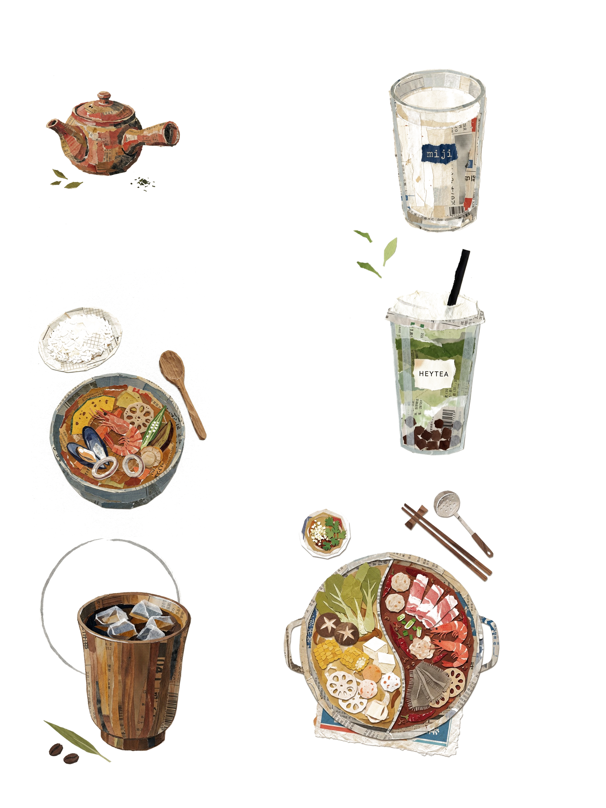
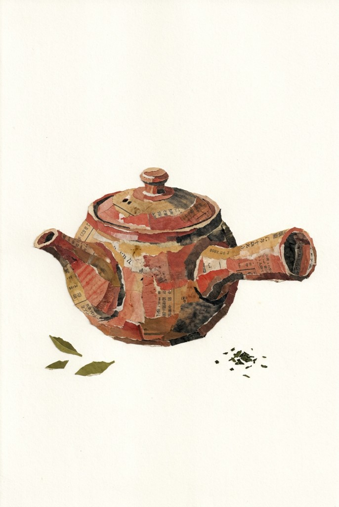
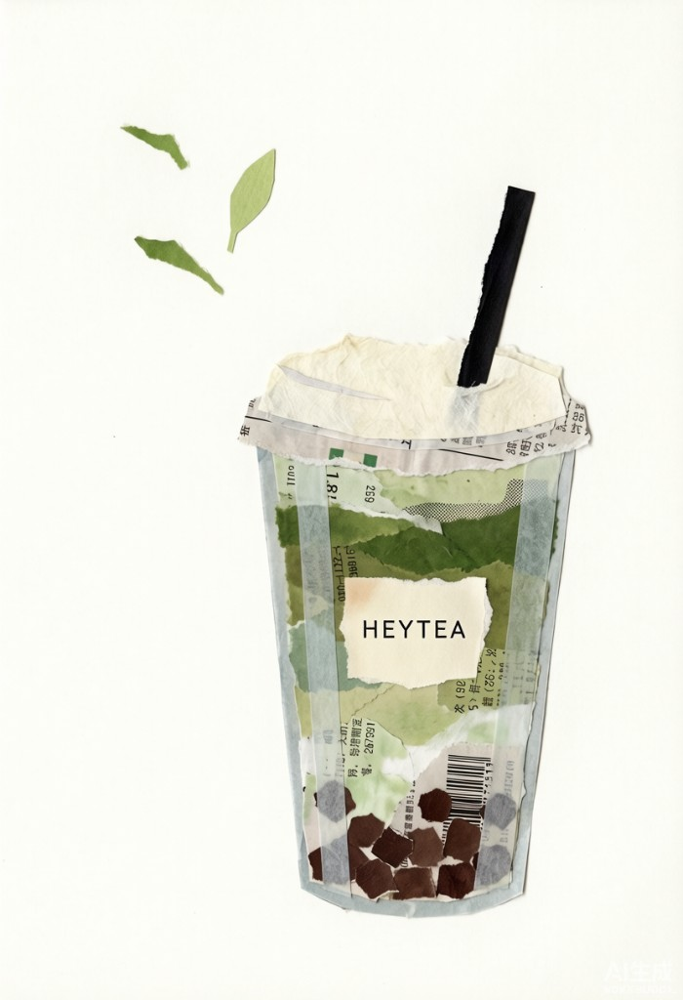
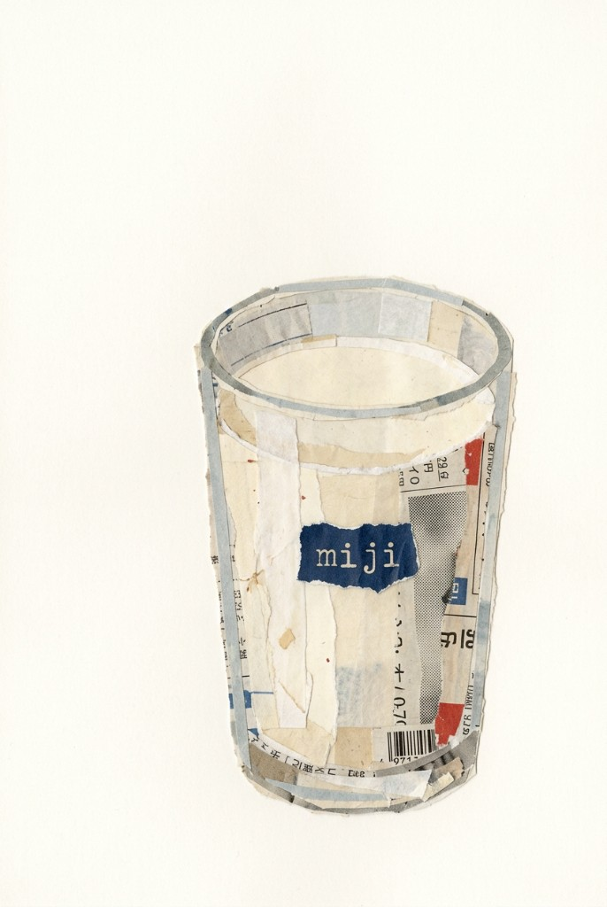
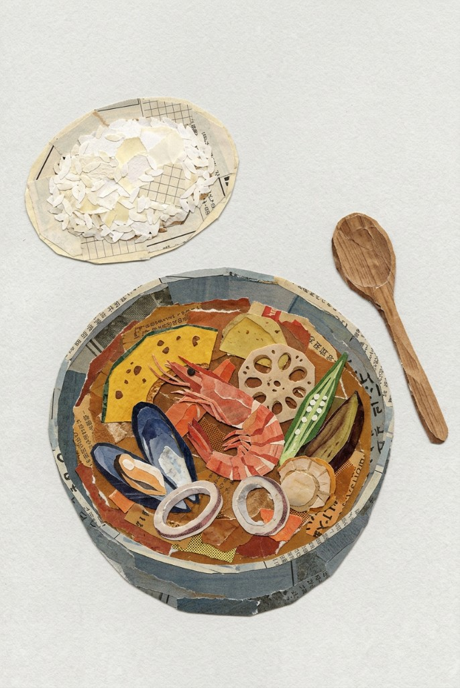
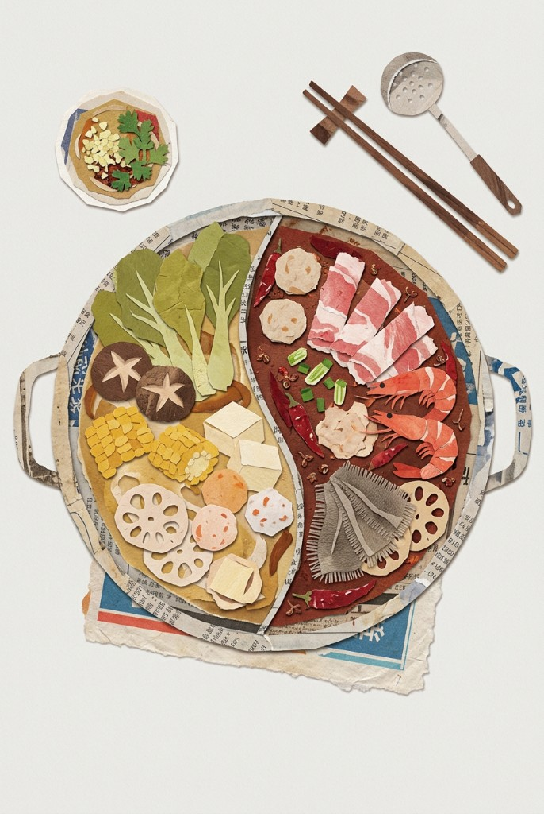
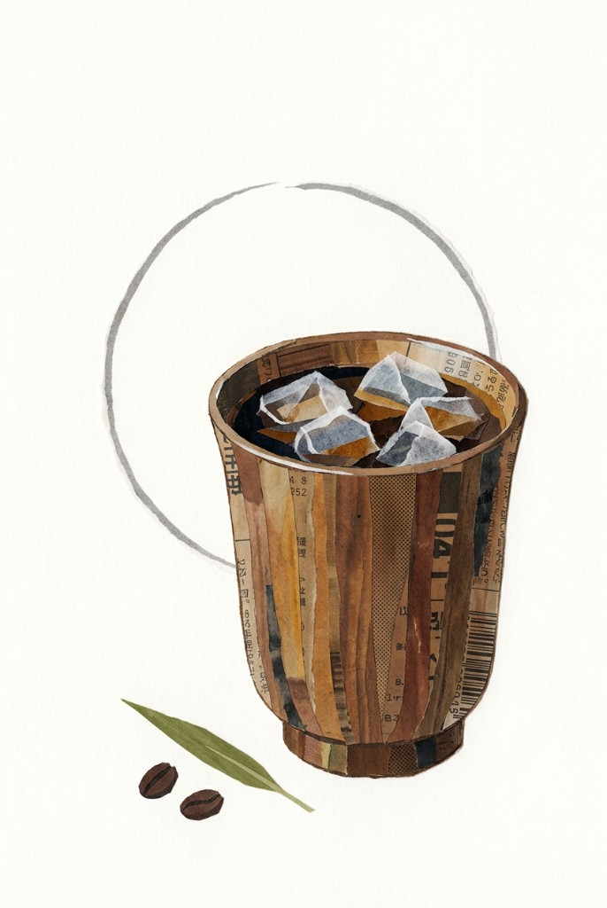

# Newspaper Food Collage

一个用于生成“旧报纸手撕拼贴”视觉的 Cursor Agent Skill。

它会把自然语言主题转译为真实手工纸艺感的图片提示词：使用旧报纸、食品包装纸和哑光彩纸塑造主体，保留毛边、纸纤维、错位粘贴、印刷纹理与大片纯白留白。

## 灵感来源

本项目的灵感来自日本新闻纸拼贴艺术家**木村セツ（Setsu Kimura）**及其 2026 年巡回展“**97歳セツの新聞ちぎり絵 原画展**”。

木村セツ 1929 年出生于奈良县樱井市，在丈夫去世后于 2019 年元旦、90 岁时开始创作新闻撕贴画。她将食物和日常生活作为题材，借助新闻纸原有的文字、色彩和网点创造出细密、温暖且富有幽默感的作品。2026 年她迎来 97 岁，年度巡展进入第七年；其中笠间日动美术馆的大规模展展出了约 180 件原画。

本项目学习和致意的是旧报纸材料、日常题材与手工撕贴方法，并非木村セツ或相关展览机构的官方项目，也不用于复刻具体原作。

- [里山社：2026 年巡展日程](https://satoyamasha.com/3248)
- [美术展ナビ：木村セツ生平与笠间日动美术馆展览介绍](https://artexhibition.jp/topics/news/20260319-AEJ2863376/)

## 生成案例

<p align="center">
  
</p>

<p align="center">
  
  
  
</p>

<p align="center">
  
  
  
</p>

## 风格特征

- 旧报纸、广告页和食品包装纸的再生材料质感
- 不规则手撕边缘、纸张纤维、翘边与叠层
- 低饱和的土黄、砖红、橄榄绿、灰褐配色
- 印刷文字、数字、网点和条码作为表面纹理
- 单物标本、散点图鉴、餐食组合和复古海报构图
- 柔和扫描光、统一纯白 `#FFFFFF` 背景

## 安装

将仓库克隆到 Cursor 的个人 Skills 目录：

```bash
git clone https://github.com/poemszhang/newspaper-food-collage.git \
  ~/.cursor/skills/newspaper-food-collage
```

重新开启 Cursor 会话后即可通过自然语言自动触发。

## 使用示例

```text
用报纸撕贴食物风做一张草莓奶油蛋糕，竖版，留白多一点。
```

```text
画一组广州早茶：虾饺、烧卖、叉烧包和茶壶，像复古废纸图鉴。
```

```text
把我的猫做成旧报纸和零食包装拼贴，单物标本构图。
```

```text
做一张现代一点的报纸拼贴海报，主体是咖啡和可颂，标题区留空。
```

```text
给我这个风格的提示词，主题是秋天的蘑菇篮。
```

## 默认生成规则

未指定细节时，Skill 默认使用：

- 1–5 个主体
- 纯白 `#FFFFFF` 竖版背景
- 松散、不对称的散点构图
- 正视或轻微俯视视角
- 无可读标题、品牌、签名或水印

只有明确要求“透明贴图”或“透明底”时，才改为带真实 Alpha 通道的透明 PNG。

完整的风格定义、提示词模板、负面约束和验收标准请参阅 [`SKILL.md`](./SKILL.md)。

## 说明

本 Skill 蒸馏的是可复用的材料、构图和手工工艺特征，不用于复制特定作品的完整布局、签名、水印或独有文字。
